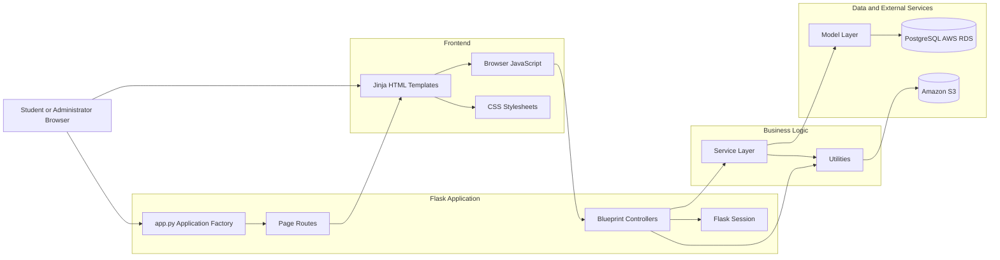
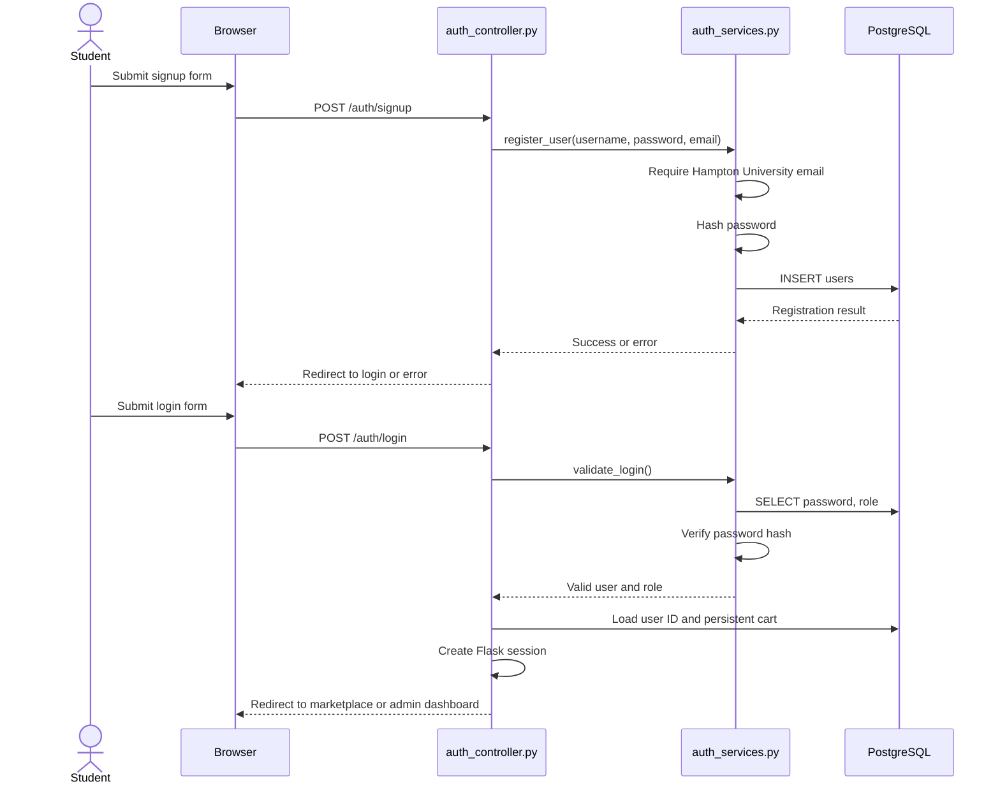
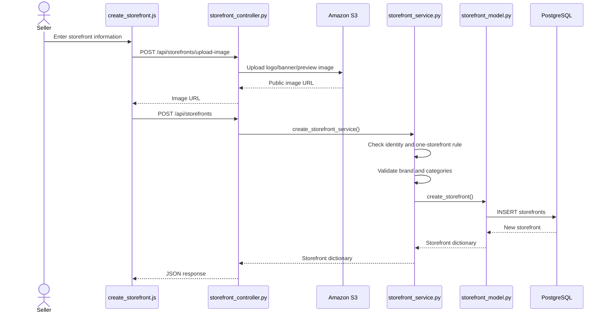
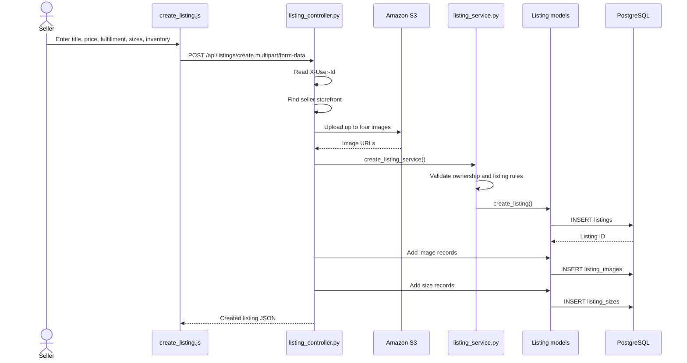
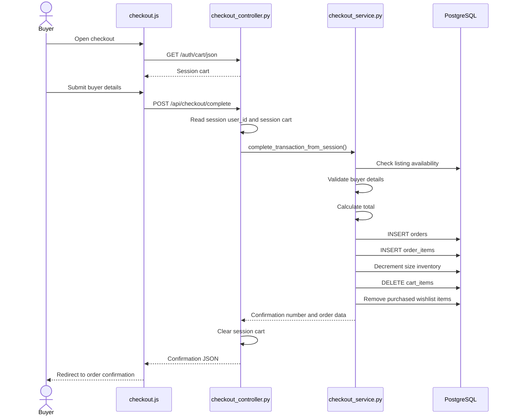
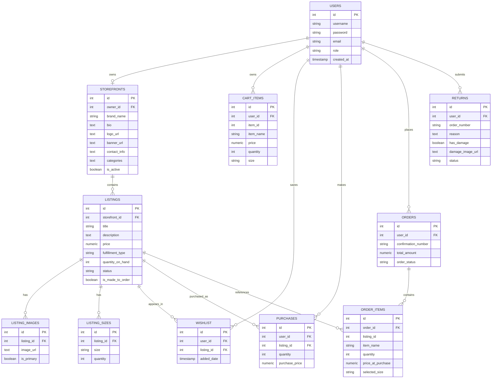
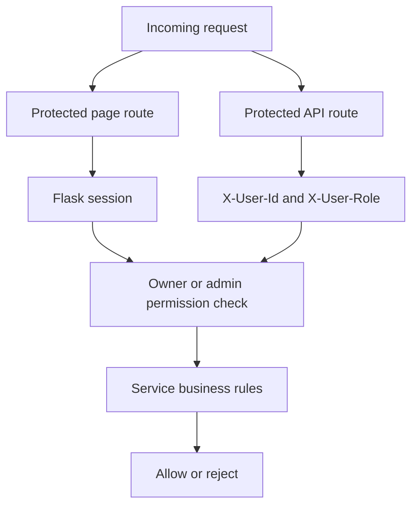

# The Vault Marketplace
## Application Architecture and System Flow Guide

## 1. Purpose of This Document

This document explains how The Vault works as a complete software system. It is intended to provide enough information to create an architecture diagram, presentation, or technical report.

The Vault is a campus marketplace for Hampton University students. Sellers create storefronts and listings. Buyers browse products, save products to wishlists, add products to a cart, complete an in-person checkout, and submit return requests. Administrators moderate the marketplace.

The application is a server-rendered Flask web application with JavaScript-enhanced pages. The backend uses a layered architecture:

```text
Browser
  |
  v
Flask page route
  |
  v
Jinja HTML template
  |
  v
Browser JavaScript
  |
  v
Flask API controller
  |
  v
Service layer
  |
  v
Database model layer
  |
  v
PostgreSQL
```

Images use a separate external storage flow:

```text
Browser image upload
  -> Flask controller
  -> S3 utility
  -> Amazon S3
  -> public image URL
  -> PostgreSQL record
```

## 2. Technology Stack

| Layer | Technology | Purpose |
|---|---|---|
| Web framework | Flask | Routes, sessions, templates, JSON responses |
| Language | Python | Backend application code |
| Frontend | HTML, CSS, JavaScript | Pages, forms, browser interactions |
| Templates | Jinja2 | Server-side HTML rendering |
| Database | PostgreSQL | Persistent application data |
| Database driver | psycopg2 | Python-to-PostgreSQL connection |
| Image storage | Amazon S3 | Store uploaded storefront, listing, and return images |
| AWS hosting | Elastic Beanstalk | Runs the deployed Flask application |
| Web server | Gunicorn | Production process server |
| Password security | Werkzeug | Password hashing and verification |
| Version control | Git/GitHub | Source code management |

The deployment command is defined in `Procfile`:

```text
web: gunicorn --pythonpath backend app:app
```

## 3. Repository Structure

```text
app.py                         Flask application factory and page routes
Procfile                       Production Gunicorn command
README.md                      Project setup and deployment notes
requirements.txt               Python dependencies

backend/
  init_db.py                   PostgreSQL schema creation and migrations
  db.py                        Main database connection helper
  config/
    db.py                      Older/config-specific database helper
    settings.py                Environment configuration class
  controllers/                 HTTP routes and request/response handling
  services/                    Business rules and workflows
  models/                      Direct SQL and database result formatting
  utils/                       Shared helpers, authentication, database, S3
  tests/                       Feature, integration, and database tests

static/
  css/                         Page-specific stylesheets
  js/                          Browser-side behavior and API calls

templates/                     Jinja HTML pages
```

## 4. Application Startup

The main entry point is `app.py`.

Startup sequence:

1. Python adds `backend/` to the import path.
2. Flask imports the controller blueprints.
3. `create_app()` creates the Flask application.
4. The application sets a Flask secret key.
5. `create_vault_tables()` attempts to create or migrate database tables.
6. Root page routes are registered.
7. Controller blueprints are registered.
8. The application exposes the resulting Flask object as `app`.
9. In production, Gunicorn runs `app:app`.

The database initialization is attempted on every application startup. This means startup can perform schema creation and simple `ALTER TABLE` migrations.

## 5. Main Architecture Diagram

This is the high-level diagram to recreate in a presentation or diagramming tool:



## 6. Flask Blueprints and Their Responsibilities

### `auth_controller.py`

Blueprint name: `auth`

Registered prefix: `/auth`

Responsibilities:

- Login and registration pages.
- Password validation through `AuthService`.
- Flask session creation and clearing.
- Account page access.
- Cart page access.
- Add/remove cart operations.
- Current-session-user JSON endpoint.
- Temporary admin login.

Important routes:

```text
GET/POST /auth/login
GET/POST /auth/signup
GET      /auth/listings
GET      /auth/account
GET      /auth/logout
GET      /auth/cart
POST     /auth/add_to_cart
POST     /auth/remove_from_cart/<index>
GET      /auth/api/auth/me
GET      /auth/cart/json
GET      /auth/debug/session
GET/POST /auth/admin-login
```

### `storefront_controller.py`

Contains two blueprints:

```text
storefront_bp       API routes under /api/storefronts
storefront_pages_bp HTML page routes without a prefix
```

Responsibilities:

- Render storefront pages.
- Create, retrieve, update, deactivate, and reactivate storefronts.
- Upload storefront images to S3.
- Enforce basic identity checks before calling services.

API routes:

```text
GET    /api/storefronts
GET    /api/storefronts/<storefront_id>
POST   /api/storefronts
GET    /api/storefronts/me
PUT    /api/storefronts/<storefront_id>
PATCH  /api/storefronts/<storefront_id>/deactivate
PATCH  /api/storefronts/<storefront_id>/reactivate
POST   /api/storefronts/upload-image
```

Page routes:

```text
GET /storefronts
GET /storefronts/create
GET /storefronts/my
GET /storefronts/<storefront_id>
GET /listings/create
GET /storefronts/dashboard
GET /storefronts/<storefront_id>/edit
GET /listings/<listing_id>/edit
```

### `listing_controller.py`

Blueprint name: `listing_bp`

Registered prefix: `/api`

Responsibilities:

- Listing CRUD operations.
- Listing status changes.
- Listing image management.
- Size and inventory management.
- Multipart form handling for listing creation.
- Uploading listing images to S3.

Routes:

```text
POST   /api/listings/create
POST   /api/storefronts/<storefront_id>/listings
GET    /api/storefronts/<storefront_id>/listings
GET    /api/listings/my
GET    /api/listings/<listing_id>
PUT    /api/listings/<listing_id>
DELETE /api/listings/<listing_id>
PATCH  /api/listings/<listing_id>/deactivate
PATCH  /api/listings/<listing_id>/reactivate
PATCH  /api/listings/<listing_id>/restore

POST   /api/listings/<listing_id>/images
GET    /api/listings/<listing_id>/images
PATCH  /api/listings/<listing_id>/images/<image_id>/primary
DELETE /api/listings/<listing_id>/images/<image_id>

POST   /api/listings/<listing_id>/sizes
GET    /api/listings/<listing_id>/sizes
DELETE /api/listings/<listing_id>/sizes/<size>
```

### `checkout_controller.py`

Blueprint name: `checkout`

Registered prefix: `/api`

Responsibilities:

- Complete checkout using the current Flask session cart.
- Return order confirmation data.
- Return the current user's orders.

Routes:

```text
POST /api/checkout/complete
GET  /api/orders/by-confirmation/<confirmation_number>
GET  /api/orders/my
```

### `wishlist_controller.py`

Blueprint name: `wishlist`

Registered prefix: `/api`

Responsibilities:

- Add a listing to a user's wishlist.
- Get a user's wishlist.
- Remove a listing.
- Check whether a listing is already saved.
- Get wishlist item details.

Routes:

```text
POST   /api/wishlist
GET    /api/wishlist
DELETE /api/wishlist/<listing_id>
GET    /api/wishlist/<listing_id>/check
GET    /api/wishlist/items/<wishlist_id>
```

### `purchase_controller.py`

Blueprint name: `purchase`

Registered prefix: `/api`

Responsibilities:

- Record an older-style purchase record.
- Retrieve purchase history.
- Retrieve purchase details.

Routes:

```text
POST /api/purchases
GET  /api/purchases
GET  /api/purchases/<purchase_id>
```

This is separate from the newer `orders` and `order_items` checkout flow.

### `return_controller.py`

Blueprint name: `returns_bp`

No prefix.

Responsibilities:

- Render the returns page.
- Accept return requests.
- Upload optional damage photographs to S3.
- Create return records.

Routes:

```text
GET  /returns
POST /returns
```

### `admin_controller.py`

Blueprint name: `admin`

Registered prefix: `/admin`

Responsibilities:

- Protect administrator pages and actions.
- Display the admin dashboard.
- Manage users, listings, storefronts, and returns.

Routes:

```text
GET    /admin
GET    /admin/dashboard
GET    /admin/users
DELETE /admin/users/<user_id>
GET    /admin/listings
DELETE /admin/listings/<listing_id>
GET    /admin/storefronts
DELETE /admin/storefronts/<store_id>
GET    /admin/returns
PATCH  /admin/returns/<return_id>
```

## 7. Page-to-Frontend Map

| Page | Template | JavaScript | Main purpose |
|---|---|---|---|
| Welcome | `index.html` | Inline JavaScript | Entry point for the application |
| Login | `login.html` | Inline/form behavior | Authenticate a user |
| Signup | `signup.html` | Inline/form behavior | Register a Hampton University user |
| Storefront browser | `storefront.html` | `storefront.js` | List active storefronts |
| Storefront detail | `storefront_view.html` | `storefront_view.js` | Display products and buyer actions |
| Create storefront | `create_storefront.html` | `create_storefront.js` | Create seller storefront and upload images |
| Edit storefront | `edit_storefront.html` | `edit_storefront.js` | Modify storefront information and status |
| Seller dashboard | `my_storefront.html` | `my_storefront.js` | Manage storefront and listings |
| Create listing | `create_listing.html` | `create_listing.js` | Create product listing and inventory |
| Edit listing | `edit_listing.html` | `edit_listing.js` | Modify listing, images, and sizes |
| Cart | `cart.html` | Mostly server-rendered | Review and remove cart items |
| Checkout | `checkout.html` | `checkout.js` | Submit buyer information and complete order |
| Confirmation | `order_confirmation.html` | Inline JavaScript | Display completed order |
| Account | `account.html` | Inline JavaScript | Display account and order information |
| Returns | `returns.html` | `returns.js` | Submit return request |
| Admin dashboard | `admin_dashboard.html` | `admin.js` | Moderate the marketplace |
| Admin login | `admin_login.html` | Form behavior | Temporary administrator entry point |

## 8. Core User Journeys

### 8.1 Registration and Login



### 8.2 Browse Storefronts

```text
/storefronts
  -> storefront.html
  -> storefront.js
  -> GET /api/storefronts
  -> storefront_controller
  -> storefront_model.get_active_storefronts()
  -> storefronts table
  -> JSON storefront list
  -> JavaScript creates storefront cards
```

Clicking a storefront leads to:

```text
/storefronts/<id>
  -> storefront_view.html
  -> storefront_view.js
  -> GET /api/storefronts/<id>
  -> GET /api/storefronts/<id>/listings
  -> GET /api/listings/<listing_id>/images
  -> GET /api/listings/<listing_id>/sizes
```

### 8.3 Create a Storefront



### 8.4 Create a Listing



### 8.5 Add to Cart

Cart operations are primarily implemented in `auth_controller.py`.

```text
Product page
  -> POST /auth/add_to_cart
  -> verify user session
  -> query listings for availability
  -> INSERT cart_items
  -> append item to session["cart"]
  -> redirect to /auth/cart
```

The cart has both persistent and session representations:

```text
PostgreSQL cart_items table = persistent cart
Flask session["cart"]       = active browser cart copy
```

At login, the database cart is loaded into the session. During checkout, the session cart is used as the source for the order.

### 8.6 Checkout



No actual online payment processor is used. The project describes checkout as an in-person exchange model.

### 8.7 Wishlist

```text
Storefront detail page
  -> GET /api/wishlist/<listing_id>/check
  -> display saved/not-saved state

Click wishlist button
  -> POST /api/wishlist
  -> WishlistService
  -> wishlist_model
  -> wishlist table

Click remove
  -> DELETE /api/wishlist/<listing_id>
```

The database has a unique constraint on `(user_id, listing_id)`, preventing duplicate wishlist entries.

### 8.8 Returns

```text
returns.html
  -> user fills order number, reason, damage status
  -> optional damage image upload
  -> POST /returns
  -> upload image to S3 if present
  -> return_service.create_return_service()
  -> INSERT returns
  -> pending return appears in admin dashboard
```

Return lifecycle:

```text
pending -> reviewed -> resolved
```

### 8.9 Administration

```mermaid
flowchart TD
    Admin[Administrator]
    Login[Admin session]
    Dashboard[/admin dashboard]
    Controller[admin_controller.py]
    Service[admin_service.py]
    Model[admin_model.py]
    DB[(PostgreSQL)]

    Admin --> Login
    Login --> Dashboard
    Dashboard --> Controller
    Controller -->|authorize session role=admin| Service
    Service --> Model
    Model --> DB
```

The admin dashboard uses `admin.js` to request:

```text
GET    /admin/users
DELETE /admin/users/<id>
GET    /admin/listings
DELETE /admin/listings/<id>
GET    /admin/storefronts
DELETE /admin/storefronts/<id>
GET    /admin/returns
PATCH  /admin/returns/<id>
```

## 9. Service Layer Responsibilities

### `auth_services.py`

- Restricts registration to Hampton University email addresses.
- Hashes passwords before storage.
- Verifies password hashes at login.
- Loads persistent carts.
- Clears persistent carts.

### `storefront_service.py`

- Enforces one storefront per user.
- Validates storefront name.
- Normalizes categories.
- Enforces a maximum of three categories.
- Checks owner/admin permissions.
- Coordinates storefront status with listing status.

### `listing_service.py`

- Validates title, price, fulfillment type, and inventory.
- Checks storefront ownership.
- Controls listing status transitions.
- Supports soft deletion and restoration.
- Manages listing images.
- Manages per-size inventory.
- Limits listings to four images.

### `checkout_service.py`

- Validates current inventory.
- Validates buyer information.
- Calculates order total.
- Generates confirmation number.
- Creates orders and order items.
- Decrements size inventory.
- Clears the cart.
- Removes purchased listings from the wishlist.

### `wishlist_service.py`

- Validates listing existence.
- Adds, removes, and retrieves wishlist entries.
- Checks wishlist membership.

### `purchase_service.py`

- Validates listing availability.
- Creates older-style purchase history records.
- Retrieves purchase history and details.

### `return_service.py`

- Validates return information.
- Normalizes damage flags.
- Creates return requests.
- Validates return statuses.

### `admin_service.py`

- Delegates admin reads and moderation operations to admin models.
- Validates required IDs.
- Updates return statuses.

## 10. Database Design

The database schema is created in `backend/init_db.py`.

### Entity relationship diagram



### Relationship explanations

- One user can own zero or one storefront because `storefronts.owner_id` is unique.
- One storefront can contain many listings.
- One listing can have many image records.
- One listing can have many size inventory records.
- One user can have many cart items.
- One user can save many listings through the wishlist table.
- One user can have many older-style purchase records.
- One user can place many orders.
- One order can contain many order items.
- One user can submit many return requests.
- Most foreign keys use cascading deletion for dependent records.

## 11. Listing and Storefront Statuses

### Storefront status

```text
is_active = TRUE
  Public storefront; visible to marketplace users.

is_active = FALSE
  Hidden from public users, but accessible to owner/admin.
```

### Listing status

```text
ACTIVE
  Available/live listing.

INACTIVE
  Temporarily hidden or manually deactivated listing.

SOLD_OUT
  In-stock item with zero inventory.

DELETED
  Soft-deleted listing retained for tracking or restoration.
```

The service layer stores previous recoverable states in fields such as:

```text
storefront_restore_status
deleted_restore_status
```

This allows a storefront or listing to be restored without losing the state it had before deactivation.

## 12. Authentication and Authorization

The application currently has two identity mechanisms.

### Flask session authentication

The login controller stores:

```text
session["user"]
session["role"]
session["user_id"]
session["cart"]
```

This is used by page routes and checkout/admin authorization.

### Header-based API identity

Several API controllers read:

```text
X-User-Id
X-User-Role
```

The header-based API identity is used by listing, storefront, wishlist, purchase, and some return operations.

A simplified authorization diagram is:



For a diagram, represent this as two authentication arrows joining at the service authorization layer.

## 13. Image Storage Flow

Images are not stored inside PostgreSQL as binary data. The application stores image URLs.

```text
Storefront/listing/return form
  -> multipart file request
  -> controller validates extension
  -> utils/s3.py generates unique filename
  -> boto3 uploads file to S3
  -> S3 URL returned
  -> URL stored in storefronts, listing_images, or returns
```

Typical S3 folders include:

```text
storefronts/
listings/
returns/damage/
```

## 14. Testing Structure

Tests are in `backend/tests/`.

| Test file | Coverage |
|---|---|
| `test_admin.py` | Admin authorization and admin routes |
| `test_checkout.py` | Checkout, order creation, and authentication behavior |
| `test_create_listing_feature.py` | Listing creation, image requirement, authentication |
| `test_wishlist_feature.py` | Add, check, retrieve, remove, and duplicate wishlist behavior |
| `test_storefront_driver.py` | Storefront model, service, database, and API behavior |
| `test_user.py` | Registration flow against the database |
| `test_db.py` / `test_db_driver.py` | Database connectivity and database behavior |
| `test_login_driver.py` | Login behavior |
| `test_register_driver.py` | Registration behavior |
| `test_cart_persistence_driver.py` | Persistent cart behavior |
| `test_storefront_driver.py` | Storefront lifecycle and ownership rules |
| `usersettingstest.py` | Older in-memory user settings functionality |
| `inspect_db.py` | Database inspection utility |

The tests are a mixture of:

- Flask test-client tests.
- Direct model/database tests.
- Integration tests against the configured PostgreSQL database.
- Older driver-style scripts.

## 15. Important Boundaries to Show in a Diagram

Use these visual boundaries:

```text
[Browser/UI]
  HTML, CSS, JavaScript

[HTTP Boundary]
  Flask page routes and JSON API routes

[Application Boundary]
  Controllers, services, utilities

[External Services Boundary]
  PostgreSQL on AWS RDS
  Amazon S3

[Deployment Boundary]
  AWS Elastic Beanstalk running Gunicorn
```

Recommended arrow labels:

```text
renders
fetches JSON
checks session
checks X-User-Id
validates ownership
executes SQL
uploads image
returns public URL
creates order
updates inventory
```

## 16. Recommended One-Page Diagram Layout

For a large architecture diagram, arrange the content into four horizontal layers.

### Layer 1: User interfaces

```text
Welcome | Login | Signup | Storefront Browser | Storefront Detail
Create Storefront | Seller Dashboard | Create Listing | Edit Listing
Cart | Checkout | Confirmation | Returns | Admin Dashboard
```

### Layer 2: Page routes and browser scripts

```text
app.py page routes

auth_controller.py
storefront_controller.py page routes
admin_controller.py page route

storefront.js
storefront_view.js
create_storefront.js
create_listing.js
my_storefront.js
edit_storefront.js
edit_listing.js
checkout.js
returns.js
admin.js
```

### Layer 3: API controllers and services

```text
auth_controller -> auth_services
storefront_controller -> storefront_service
listing_controller -> listing_service
checkout_controller -> checkout_service
wishlist_controller -> wishlist_service
purchase_controller -> purchase_service
return_controller -> return_service
admin_controller -> admin_service
```

### Layer 4: Database and external services

```text
PostgreSQL:
users, storefronts, listings, listing_images, listing_sizes,
cart_items, wishlist, purchases, orders, order_items, returns

Amazon S3:
storefront images, listing images, return damage images
```

The most important cross-layer arrows are:

```text
Storefront Browser
  -> GET /api/storefronts
  -> storefront_controller
  -> storefront_service/model
  -> storefronts

Storefront Detail
  -> storefront_view.js
  -> storefront and listing APIs
  -> storefronts/listings/listing_images/listing_sizes

Create Listing
  -> POST /api/listings/create
  -> S3 upload
  -> listing_service
  -> listings/listing_images/listing_sizes

Add to Cart
  -> POST /auth/add_to_cart
  -> cart_items and Flask session

Checkout
  -> POST /api/checkout/complete
  -> orders/order_items
  -> inventory and cart updates

Wishlist
  -> /api/wishlist routes
  -> wishlist_service
  -> wishlist

Returns
  -> POST /returns
  -> S3 damage image upload
  -> returns

Administration
  -> /admin routes
  -> admin_service/admin_model
  -> users/listings/storefronts/returns
```

## 17. Known Implementation Notes

These notes explain why the diagram may show duplicate or disconnected-looking pieces.

1. There are duplicate page routes for some screens. For example, the storefront can be reached through `/storefront`, `/auth/listings`, or `/storefronts`.
2. The application mixes Flask session authentication with `X-User-Id` and `X-User-Role` headers.
3. Cart behavior is implemented inside the authentication controller rather than a dedicated cart controller/service.
4. The older purchase feature uses `purchases`, while the newer checkout flow uses `orders` and `order_items`.
5. Some purchase and wishlist comments identify those features as unfinished, even though wishlist routes and tests exist.
6. `account_controller.py` appears unfinished and is not registered in `app.py`.
7. Some test files reflect older endpoint contracts and may not match the newest checkout implementation.
8. Storefront and listing deletions are handled differently: listings use soft deletion, while the admin model directly deletes users and storefronts.
9. Database connection helpers exist in more than one location, reflecting incremental development.
10. The root `.env` contains sensitive database and cloud credentials. Those values are intentionally excluded from this document. They should be rotated and managed through a secure environment or deployment secret store.
11. The application currently hardcodes a Flask secret key in `app.py` even though environment-based secret configuration also exists.

## 18. Short Explanation for a Presentation

The Vault is a Flask marketplace application organized into frontend, controller, service, model, and database layers. A user interacts with HTML pages enhanced by JavaScript. JavaScript calls Flask API routes, controllers validate the request and identify the user, services enforce marketplace rules, and model functions execute SQL against PostgreSQL. Storefront and listing images are uploaded to Amazon S3, while only their URLs are saved in the database.

The central business relationship is that users own storefronts, storefronts contain listings, and listings can have images and size-specific inventory. Buyers interact with listings through wishlists, carts, orders, and returns. Administrators use a protected dashboard to moderate users, listings, storefronts, and return requests.

The most important end-to-end flow is:

```text
User
  -> Browser page
  -> JavaScript request
  -> Flask controller
  -> Service validation and authorization
  -> Database model
  -> PostgreSQL or S3
  -> JSON response
  -> Updated browser page
```
